### 视觉和语言预训练（Vision-and-Language Pre-training，VLP）
目标函数也基本上是 image text matching（图像-文本的匹配的loss）和 masked language modeling（NLP中如BERT等使用的掩码学习)

### 从模型架构上来分
#### 单流架构 基于Self-Attention
**特点**
  - 多个模态的内容直接拼接，输入到模型中。相当于将单模态的内部交互与多模态之间的交互合在一起
  例如：vision的q来自于图像，其k、v则即来自于图像也来自于文本；文本侧也是如此。
#### 双流架构 基于Cross-Attention
**特点**
  - 先做单模态内部交互，再做多模态之间的交互。
  - 交叉注意力层：查询Query来自一种模式，而key、value来自另一种模式。通常包含两个单向交叉注意力层：一个是语言到视觉，另一个是视觉到与语言。他们负责在两种模式之间交换信息和调整语义。
#### Dual Encoder
**特点**
  - 经典范式：CLIP
  - 浅层交互：模态之间仅使用相似度的交互
  - 需要在一个预训练好的
  - 优点：文本和图像侧的表示是预训练好的，文本encoder与图像encoder完全解耦
  - 缺点：只用了浅层交互，无法适用于多模态推理方面的工作
  
#### Fusion Encoder + Dual encoder
  - 经典范式：VLMO 
    - 提出了混合模态专家Transformer（Mixture-of-Modality-Experts Tranformer）
    - VLMO还提出了新的分阶段的预训练策略，后面细讲
  - 出发点：fusion encoder的交互更深入，能学习到更细粒度的跨模态信息特征，但是计算复杂度高，而dual encoder交互不够，但推理速度更快。希望将两种encoder方式融合，让模型学习到细粒度多模态信息的同时也可以学到更宏观的多模态表示。
    - 三类输入：
      - 图像侧：Image Patch
      - 文本侧：复用Bert的文本编码方式
      - 图-文输入：由图像输入和文本嵌入拼接而成
    - 目标：训练三个不同的专家：分别是视觉专家（V-FFN）、语言专家（L-FFN）、视觉-语言专家(VL-FFN)，让他们完成各自的预训练任务。
  - 优点
    - 更好的适配不同的下游任务，可以完成视觉-语言的检索、分类（视觉问答、视觉推理）等任务  
### 从发展历程来说
#### ViT
《AN IMAGE IS WORTH 16X16 WORDS: TRANSFORMERS FOR IMAGE RECOGNITION AT SCALE》，翻译而来就是，一张图片值256（16 X 16）个词。  
参考链接<https://zhuanlan.zhihu.com/p/617175563?utm_id=0> 
模型结构如图所示  
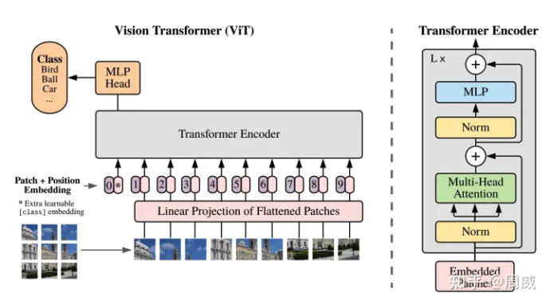 
1.将图像等分成个图像块（image patch），这里的就是（为了简化，作者在上图用了）；  
2.将图像块从左到右，从上到下依次输入到线性映射层（全连接层），输入之前对每个图像块进行铺平，全连接层将每个图像块映射成维向量（embeddings）；  
3.设置一个类别记号（class token），其类型为可学习的张量，维度为D维（图中的*）；  
4.为“类别记号+每个图像块特征“赋予一个位置编码，位置编码是一个可学习的参数，维度为D；  
5.将“类别记号+每个图像块特征“与其位置编码进行按位相加，作为Transformer编码器的输入；  
6.取Transformer编码器输出的第一个embedding（即类别记号对应的embedding），将其输入到多层感知器中（MLP），输出所属类别概率；  
补充描述：   
如果输入图像的分辨率较高，那么仍保持每个图像块的尺度大小不变，这样的话，图像块的数量会增加，输入到ViT的序列长度也会增加；  
类别分类是借鉴BERT的。ViT是用于图像分类任务的，图分类是CNN提取特征后+全连接层将提取的图像特征输出类别概率。这里最终的图像特征，可以用池化操作（pooling）对Transformer输出的所有序列进行均值池化获得的，也可以取输出序列的第一个embedding。这里作者选择了后者；  
ViT仅采用基础Transformer中的编码器用于图像特征提取，因为是分类任务不是生成任务（类似翻译），所以无需解码器；  
ViT中的Transformer编码器由多层编码层构成，每个编码层主要由一个多头注意力和多层感知器MLP（全连接层+激活）通过残差连接构成；  
#### ViLT   
Vision-and-Language Transformer Without Convolution or Region Supervision 
多模态模型运行过程中，图片特征提取上花费的时间非常长，远超文本处理时间(图片特征800ms，文本特征15ms)，ViLT提前图片特征仅用0.4ms，运行时间大幅下降且模型效果不会下降很多。 
参考链接：<https://blog.csdn.net/Friedrichor/article/details/127167784> 
优点 
- ViLT是迄今为止最简单的 vision- and-language 模型，除了模态融合用的 Transformer 外就没用其它模型了（以往还需要用到 ResNet，甚至还有目标检测的网络）。ViLT带来了非常短的运行时间和参数量的减少。 
- 在减少计算复杂度的同时，ViLT能够保证在不使用 Region Features 和 CNN 的情况下性能下降很少甚至不降，这是以往工作中达不到的。 
- 在训练时用了更多的数据增强方式，如在文本部分将整个词 mask 掉，在图像部分使用图像增强，使得模型性能得到提高。 
- 文本，图像，模态交互，哪个更重 
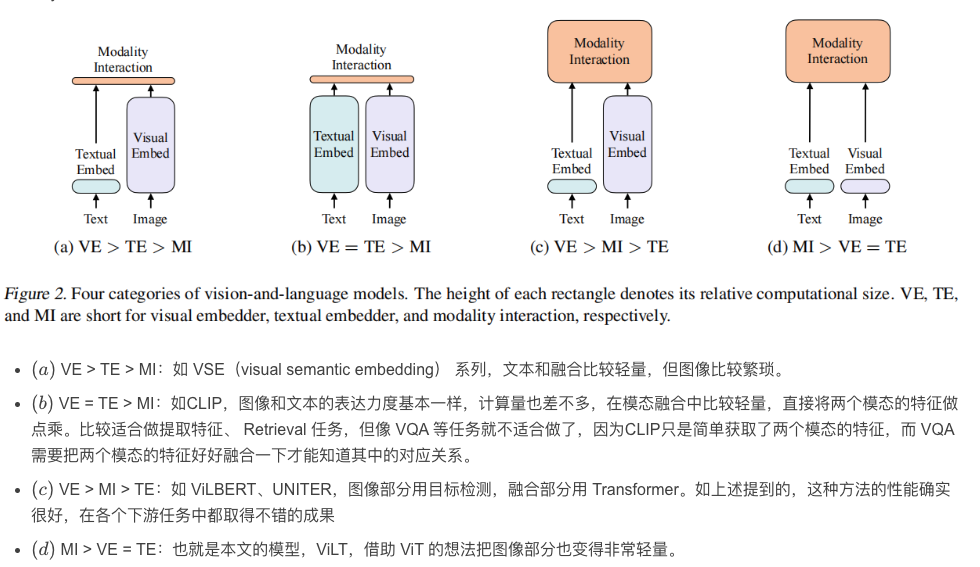 
上图中modality interaction，模态交互 
- single-stream approaches：只用一个模型。那么怎么解决两个模态的输入呢？最简单的方法就是将两个输入 concat 起来，把两个序列合并成一个序列就可以输入到一个模型去了。 
- dual-stream approaches：用两个模型。这两个模型先各自对各自的输入做一些处理，充分挖掘单模态中的信息，然后在后面再做一些融合。 
- ViLT使用的是 single-stream。 
ViLT模型结构 
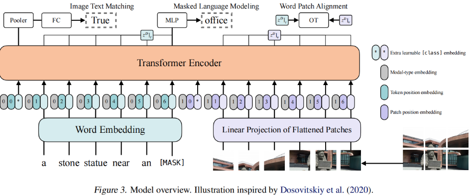 
- 文本序列通过 BERT tokenizer 得到 word embedding，假如文本序列的长度为 L，token embedding 的维度为 H，所以文本输入到 Transformer 的是 L×H 的矩阵。
- 图像先是分成若干个 patch，每个 patch 通过 patch embedding 就又变成一系列的 token。假设图像 token 的序列长度是 N，token embedding 的维度依旧为 H，所以图像输入到 Transformer 的是 N×H 的矩阵。
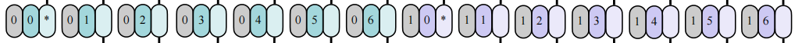 
- 星号部分就是[CLS] token，左边的就是文本的[CLS] token，右边的就是图像的[CLS] token。
- 灰色部分表示模态的类别，如图文本部分都是 0，图像部分就是 1。对于 single-stream 方法，是将文本和图像 concat 起来成一系列 token 作为 Transformer 的输入，如果不告诉模型哪块是文本，哪块是图像，可能不利于模型的学习；如果告诉模型哪块是文本，哪块是图像，模型可能会去训练文本与图像之间的关系，更有利于学习。
- 深绿色和深紫色（对应图中的0 1 2 3 4 5 6）分别是文本和图像中的position embedding。
- 浅绿色和浅紫色分别是文本和图像通过 embedding 层后生成的 token embedding。 
**输出部分** 
- Image Text Matching 和 Word Patch Alignment 都是用来计算文本和图片之间的相似性，是否匹配。Masked Language Modeling 用于文本部分。
- Word Patch Alignment 也是用来计算文本特征和图像特征之间的相似度，利用 optimal transport（最优运输理论），可以理解成将文本的输出和图像的输出当成一个概率分布，然后计算这两个分布之间的距离，这里当然也是越小越好。
- Masked Language Modeling 相当于完形填空，把其中某个单词 mask 掉，再通过模型重建，这是基本所有 NLP 任务中都会用到的。这里其中一个可改进的地方就是在图像部分也加入“完形填空”的目标函数，但由于当时 BEiT 和 MAE 等工作还没做出，图像领域还无法很有效的去做重建任务。现在就有 VL-BEiT 在视觉部分加入了重建 loss。

#### CLIP
Learning Transferable Visual Models From Natural Language Supervision，2021 
zero-shot 的视觉分类模型 
**CLIP背景** 
在图片分类任务中，常见的计算机视觉（CV）模型通常被训练用于预测有限的物体类别。这种严格的监督训练方式限制了模型的泛化性和实用性，因为该模型通常还需要额外的标注数据来完成训练时未曾见过的视觉“概念”。直接从图片的描述文本中学习是一个有潜力的选择，因为这样我们可以获取更多的监督信号。CILP证明了利用一个简单的预训练任务（即预测哪个文本描述对应当前图像）在一个从互联网上搜集的4亿个（图像，文本）对的数据集上可以取得SOTA的图像表征。预训练完之后，在下游任务上，我们可以通过用自然语言（文本）匹配视觉概念（图像）从而实现zero-shot transfer。 
CLIP在30个不同类型的下游CV 任务上进行了基准测试，展示了模型强大的迁移能力，其在很多下游任务上不需要任何额外的数据也能比拟完全supervised的模型。比如，在ImageNet上的zero-shot accuracy能达到在ImageNet上全监督训练的ResNet-50的性能。 
**CLIP训练过程** 
CLIP的英文全称是Contrastive Language-Image Pre-training，即一种基于对比文本-图像对的预训练方法或者模型。CLIP是一种基于对比学习的多模态模型，与CV中的一些对比学习方法不同的是，CLIP的训练数据是文本-图像对：一张图像和它对应的文本描述，这里希望通过对比学习，模型能够学习到文本-图像对的匹配关系。如下图所示，CLIP包括两个模型：Text Encoder和Image Encoder，其中Text Encoder用来提取文本的特征，可以采用NLP中常用的text transformer模型；而Image Encoder用来提取图像的特征，可以采用常用CNN模型或者vision transformer。 
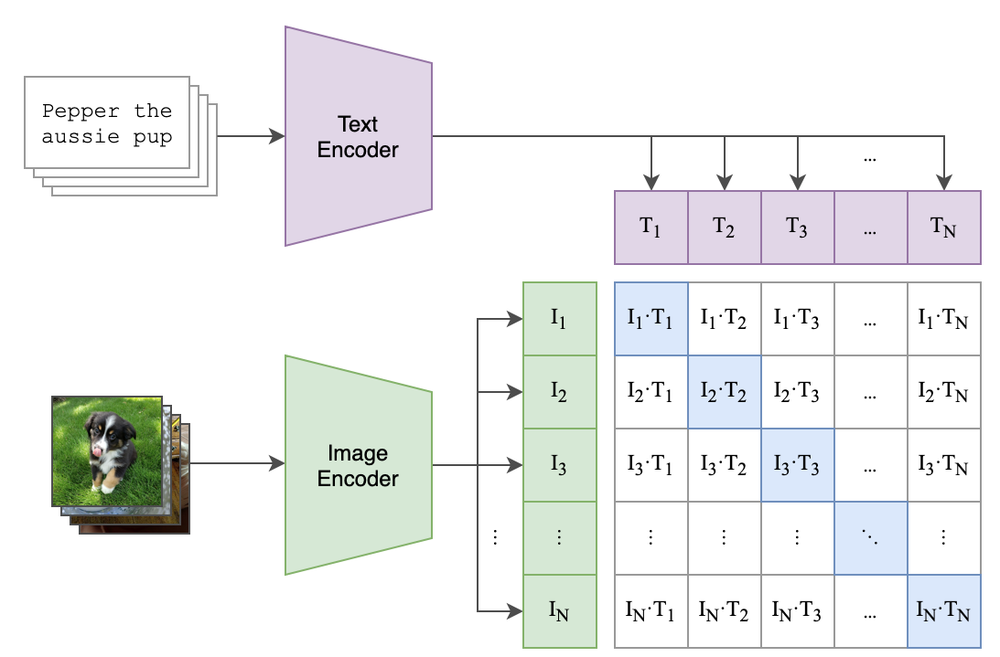 
这里对提取的文本特征和图像特征进行对比学习。对于一个包含N个文本-图像对的训练batch，将N个文本特征和N个图像特征两两组合，CLIP模型会预测出N*N个可能的文本-图像对的相似度，这里的相似度直接计算文本特征和图像特征的余弦相似性（cosine similarity），即上图所示的矩阵。这里共有N个正样本，即真正属于一对的文本和图像（矩阵中的对角线元素），而剩余的N*N−N个文本-图像对为负样本，那么CLIP的训练目标就是最大N个正样本的相似度，同时最小化N*N−N个负样本的相似度，对应的伪代码实现如下所示： 
<pre><code>
# 分别提取图像特征和文本特征
I_f = image_encoder(I) #[n, d_i]
T_f = text_encoder(T) #[n, d_t]

# 对两个特征进行线性投射，得到相同维度的特征，并进行l2归一化
I_e = l2_normalize(np.dot(I_f, W_i), axis=1)
T_e = l2_normalize(np.dot(T_f, W_t), axis=1)

# 计算缩放的余弦相似度：[n, n]
logits = np.dot(I_e, T_e.T) * np.exp(t)

# 对称的对比学习损失：等价于N个类别的cross_entropy_loss
labels = np.arange(n) # 对角线元素的labels
loss_i = cross_entropy_loss(logits, labels, axis=0)
loss_t = cross_entropy_loss(logits, labels, axis=1)
loss = (loss_i + loss_t)/2
</code></pre>
为了训练CLIP，OpenAI从互联网收集了共4个亿的文本-图像对，论文称之为WebImageText。论文中Text Encoder固定选择一个包含63M参数的text transformer模型，而Image Encoder采用了两种的不同的架构，一是常用的CNN架构ResNet，二是基于transformer的ViT，所有的模型都训练32个epochs，采用AdamW优化器 
**CLIP zero-shot分类** 
与CV中常用的先预训练然后微调不同，CLIP可以直接实现zero-shot的图像分类，即不需要任何训练数据，就能在某个具体下游任务上实现分类，这也是CLIP亮点和强大之处。用CLIP实现zero-shot分类很简单，只需要简单的两步： 
1. 根据任务的分类标签构建每个类别的描述文本：A photo of {label}，然后将这些文本送入Text Encoder得到对应的文本特征，如果类别数目为N，那么将得到N个文本特征； 
2. 将要预测的图像送入Image Encoder得到图像特征，然后与N个文本特征计算缩放的余弦相似度（和训练过程一致），然后选择相似度最大的文本对应的类别作为图像分类预测结果，进一步地，可以将这些相似度看成logits，送入softmax后可以到每个类别的预测概率。 
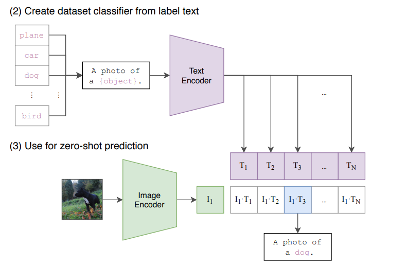 
**CLIP局限性**
- CLIP的zero-shot性能虽然和有监督的ResNet50相当，但是还不是SOTA，作者估计要达到SOTA的效果，CLIP还需要增加1000x的计算量，这是难以想象的；
- CLIP的zero-shot在某些数据集上表现较差，如细粒度分类，抽象任务等；
- CLIP在自然分布漂移上表现鲁棒，但是依然存在域外泛化问题，即如果测试数据集的分布和训练集相差较大，CLIP会表现较差；
- CLIP并没有解决深度学习的数据效率低下难题，训练CLIP需要大量的数据； 

#### FLIP
Scaling Language-Image Pre-training via Masking，2022,12 
论文围绕近来火热的CLIP（Contrastive Language-Image Pre-Training）模型展开研究，并提出了一种高效训练CLIP的图像处理新方法——FLIP（Fast Language-Image Pre-training）。 
该方法在训练中对图像块进行大比例的随机Mask遮蔽，在有限的时间内从更多的image-text数据集中学习，并且在每次迭代对比更多样本的情况下，保持相似的内存占用率。何恺明团队在4亿对image-text的训练实验中，对训练准确度和训练速度进行了利弊权衡，FLIP无论是在准确性还是速度方面的表现均优于CLIP。 
**MAE架构** 
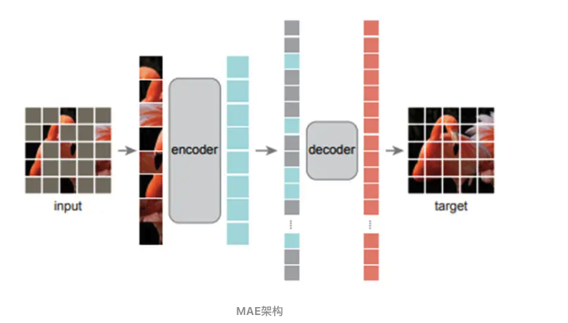 
- 图像遮蔽：论文中采用的是ViT作为图像编码器，图像首先被划分为一个不重叠的网格，参考MAE随机地遮蔽掉大比例的区块(比例为50%、75%)，这种方法可以将训练时间复杂度相应降低为原来的一半，甚至四分之一，且减少内存占用。关于MAE的详解可参考何恺明另一篇论文《Masked Autoencoders Are Scalable Vision Learners》。
- 文本遮蔽：同样的方法，还可以用于文本遮蔽上。当执行Mask时，研究人员仅对可见token进行编码处理，和BERT的处理机制不一样的是：采用Learned Mask Token进行替换。这种稀疏计算也能够在一定程度减少文本编码所需要的时长。但团队认为，因为文本编码器比较小，所带来的加速效果难以导致更好的均衡。
- 训练目标：Image/Text编码器采用对比损失进行训练优化。但和MAE不同的是，本文中的FLIP重建被遮蔽的图像内容，同时丢弃了解码器，由此取得了进一步的加速。
- 解除遮蔽：虽然编码器是在Masked图像上来实现预训练的，但是它仍然可以像MAE那样直接作用到无干扰的图像，此可作为对标的基线。为进一步降低因Mask而产生的分布差异，作者将Mask比例设为0并进行少量的连续预训练，这种处理方法可以使得训练时间和准确性达到良好的均衡。 
**训练过程** 
在训练的具体过程中，研究人员依据CLIP和OpenCLIP，做出了一些改变： 
- 图像编码器使用ViT，但在补丁嵌入后并未使用其余的图层规范，并且在图像编码的末端增添了GAP。
- 论文运用Non-AutoRegressive Transformer编码，并使用WordPiece算法。
- 图像编码器与文本编码器的输出分别投射到相同的嵌入空间，再用LTP（Learnable Temperature Parameter）进行缩放，从而得到两者的Cosine相似度。 
- 在训练CLIP期间随机移除了大部分图像块，移除的块不参与image encoder部分，进而节省计算量，可以将CLIP的训练过程加速2～3倍，而且可以实现更好的性能。 
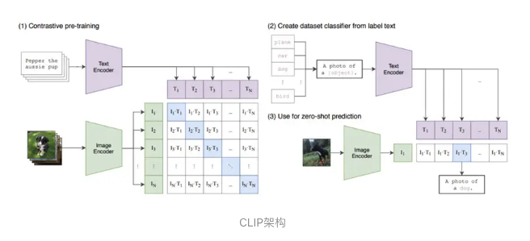 

对图像进行mask，主要有两个好处： 
1. 一是由于image encoder只处理部分patches，降低了计算用时，这样同样的训练时间内可以学习更多的图像-文本对； 
2. 二是image encoder的显存使用也下降（mask掉50%，显存消耗就下降50%），这样在一定的硬件资源下就可以实现更大的batch size，而对比学习往往需要较大的batch size。 
为了减少分布上gap，FLIP在最后增加了少量的unmasking训练，即像正常的CLIP那样不对图像进行mask，这可以进一步提升预训练模型的性能。 
由于CLIP的训练数据WIT-400M并没有开源，所以论文采用开源的LAION-400M进行实验，并将FLIP和基于LAION-400M训练的CLIP进行直接对比。下图展示了基于ViT-L/16模型（image encoder）的FLIP和OpenCLIP的对比结果，可以看到训练同样的epochs时（32 epochs），mask 50%的FLIP可以提升训练速度2倍，而且在ImageNet1K上zero-shot准确度可以提升0.9%，而mask 75%的FLIP可以提升训练速度2.9倍，而且准确度可以提升0.6%。值得注意的是，如果不进行unmasking tuning，FLIP的性能略有下降，特别是mask 75%的FLIP，其性能略差于CLIP，这说明测试和训练过程中的较大分布gap还是会一定程度影响性能的。 

#### ALBEF
Align before Fuse: Vision and Language Representation Learning with Momentum Distillation，2021 
**动机** 
学术界当前的主流方法是通过在大规模的图片-文本对（image-text pairs）的数据集上进行视觉与语言预训练（Vision-and-Language Pre-training, VLP），再在下游的具体任务上微调。当前主流的VLP模型，需要依赖预训练的目标检测器提取相应的区域图像特征，并通过基于Transformer的模型框架，辅以语言掩码建模（Masked Language Modeling, MLM）和图像文本匹配（Image-Text Matching, ITM）进行参数优化训练。 
声称这样的范式存在三个问题： 
- 目标检测器存在标注昂贵与计算昂贵的问题，且在训练阶段需要bounding box annotations，在测试阶段需要高分辨率的图像；
- 之前的方法vision与language两个模态之间的融合都是通过Transformer这种结构或者设计cross-attention实现的，对于visual tokens与word tokens都是在各自的特征表示空间进行embedding，这种细粒度级别的alignment或者interaction并未被关注；
- VLP模型的训练都是在large-scale image-text pairs data上进行，但是dataset构建过程中都是从互联网爬取数据，这些数据本身不可避免存在噪声（noisy web data）。 
如何从noisy web data学习视觉与文本表征？如何避免噪声文本的影响甚至利用噪声文本提升模型鲁棒性？ 
对于这些数据集的噪声，先前的VLP方法并没有进行特殊的处理。那会有什么坏处呢？
- 由于数据集中本身image-text pair存在噪声，就会出现text里面的描述存在不准确（别的词语描述更好）或者描述错误（某些词语内容在image中从未出现过）的现象，也会存在image中出现的内容（甚至主体内容/物体）在text中并未进行描述。现行的VLP主流框架并未考虑这一点，模型会对存在的噪声文本进行过拟合，并未实现高质量的视觉文本表征，限制了模型的表达能力；
- 即使我们直接假设image-text pairs标注质量okay，全局层面不存在噪声问题。现行的VLP模型是在全局层面image-text能构成pair的角度进行训练，但是对应到visual tokens和word tokens就会出现misalignment现象。而这些因素在过往的VLP中没有进行处理，会带来泛化性问题。 
作者设计了两个方面的措施解决上述问题： 
- 一方面是通过提出intermediate image-text contrastive （ITC）loss来监督visual tokens与word tokens的对齐问题以方便vision与language两个模态后续的跨模态交互。
- 另一方面提出Momentum Distilliation（MoD）这种自蒸馏（self-distillation）方式产生伪标签（pseudo targets）从噪声监督信号中提升模型表征能力。 
**细节** 
ALBEF包含一个图像编码器、一个文本编码器和一个多模态编码器。作者将一个12层的视觉transformer ViT-B/16作为图像编码器，并通过在ImageNet-1k上预训练的权重对图像编码器进行初始化。 
**模型结构** 
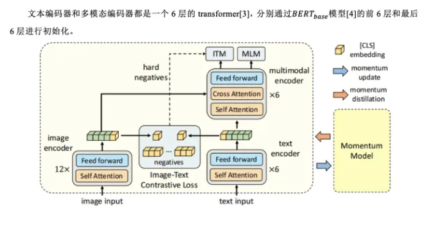 
**预训练任务** 
作者在三个目标任务上进行预训练，分别是：
- 图像文本对比学习（ITC）
- 图像文本匹配（ITM）
- 掩码语言建模（MLM）。
- 作者在单模态编码器上进行ITC和MLM训练，在多模态编码器上进行ITM训练。 
1. 图像文本对比学习（Image-Text Contrastive Learning）图像文本对比学习的目的是在融合前学习更好的单模态表示。它学习了一个相似度函数： 
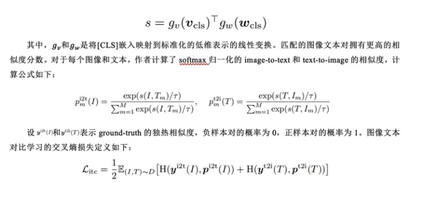 
2. 掩码语言建模（Masked Language Modeling）掩码语言建模同时利用了图像和上下文文本来预测被掩盖的词。作者以15%的概率随机掩盖输入的token，并用特殊token[MASK]来替换它们。 
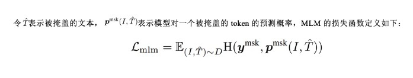 
3. 图像文本匹配（Image-Text Matching）图像文本匹配预测了一对图像文本对是positive（匹配的）还是negative（不匹配的）。作者使用了[CLS] token在多模态编码器的输出嵌入作为图像文本对的联合表示，然后通过一个带有softmax的全连接层来预测一个二分类的概率。ITM的损失函数定义如下： 
 
作者提出了一种对ITM任务进行hard negatives采样的策略。当负样本的图像文本对有相同的语义但在细粒度细节上不同，那么该样本是难样本。作者通过对比相似度寻找batch内的 hard negatives。对于一个batch中的每一幅图像，作者根据对比相似性分布从相同的batch中抽取一个负文本，其中与图像更相似的文本有更高的可能被采样。同样的，作者还为每个文本采样一个hard negative图像。 
**动量蒸馏** 
用于预训练的图像文本对大多都收集自网络，往往都包含噪声。因此，正样本对经常是弱相关的，即文本包含和图像无关的文字或图像包含文本中没有描述的实体。对于ITC学习，图像的负样本文本可能也会匹配图像的内容。对于MLM，可能存在其他和标注不同的词能够更好地描述图像。但是ITC和MLM的one-hot标签会惩罚所有负标签预测，不考虑它们的正确性。 
为了解决这一问题，作者提出从动量模型生成的伪目标中学习。动量模型是一个不断发展的教师模型，包含单模态和多模态编码器的指数移动平均版本。在训练过程中，作者训练基本模型使得它的预测值和动量模型的相匹配。对于ITC，作者首先使用来自动量单模态编码器的特征计算图像文本相似度，然后计算伪目标。 
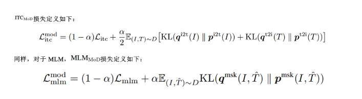 

#### BLIP
Bootstrapping Language-Image Pre-training for Unified Vision-Language Understanding and Generation，2022.07 
**动机**
- 模型层面：1.encoder模型无法做生成；2.encoder-decoder模型无法做检索任务
- 数据层面：1.网上爬取到的文本-图像对包含较多噪音 
BLIP这篇文章是ALBEF上的延续，在ALBEF的基础上，作者提出了一种MED（Multimodal mixture of Encoder-Decoder）结构，该结构是encoder+decoder的组合结构，既能用作encoder用于模态向量抽取、也能用于图像-文本的encoder训练，还能使用decoder作于图像文本生成。这种模型结构使用了参数共享机制，在图像文本对比学习、图像-文本匹配、图像语言模型三种任务上进行联合训练。 
**模型结构如图所示** 
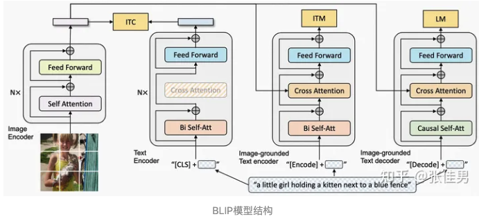 
- imagetext contrastive learning，ITC
- 首先，针对图像文本对比学习任务（imagetext contrastive learning，ITC），文本通过的是正常的transformer作为encoder，拿到文本向量之后和图片向量配对对比。与ALBEF一致，这里也用到了Momentum Distillation机制。从图中可以看到，文本任务分成的三个结构，ITC任务用到的是左侧第一个结构。这个结构就是transformer中的encoder。图像经过vit拿到embedding表示、文本通过encoder拿到embedding表示，这两个embedidng之间做相似度计算，根据label计算loss，并进行反向传播。这个任务和ALBEF中的思想是一脉相承的，在做具体的任务之前先做向量的对齐。
- Image-Text Matching，ITM
- 第二个任务是图像文本匹配任务（Image-Text Matching，ITM），该任何和ALBEF中的整体结构仍然是相似的。该任务使用的结构是模型结构图中文本处理的第二个结构，文本端使用的仍是transformer的encoder结构，图像向量通过cross attention的方式和文本模态交互。值得注意的是，在ALBEF中，作者的思路是将bert截成两段，前半段用来做encoder，后半段用来做模态融合。在BLIP这篇工作中，作者分别使用了两个完整的bert结构分别做encoder和模态交互，同时，这两个bert结构的self-attention和Feed Forward层的参数是共享的。ITC任务的训练也帮助了ITM任务的训练。
- Language Modeling ，LM
- 第三个任务是语言模型任务（Language Modeling ，LM），这个任务是BLIP和ALBEF的一个重要区别。在ALBEF中，使用的MLM（Masked Language Model），也就是完形填空任务，bert系语言模型几乎都是在MLM任务上做预训练的。在BLIP中，使用的是LM，也就是从前半句话中预测下一个字及下半句，GPT系语言模型都是在LM任务上做预训练的，LM任务会比MLM任务更难，LM任务也更适合生成式的下游任务。在这个文本模型结构中，使用的transformer中的decoder结构，decoder结构和encoder结构一个很大的区别在于输入的掩码，encoder只将中的某个词作mask，而decoder将后半句都mask。该部分的self-attention是单向结构，因此不能和ITC、ITM任务结构中的self-attention共享参数。后面的cross-attention、Feed Forward层仍与前面任务的模型参数共享。 
同时，在ITM、LM任务的文本之前，分别加上了[Encode]、[Decode]两个标识符，用以区分不同任务的，同时也给模型训练以提示。 
除此之外，作者还提出一种CapFilt（Captioning and Filtering）的数据处理方法，从充满噪声的图像-文本数据中，过滤掉质量低的数据对，并利用模型训练的中间结果给图片生成文字，将生成的图片-文本对用于训练。 
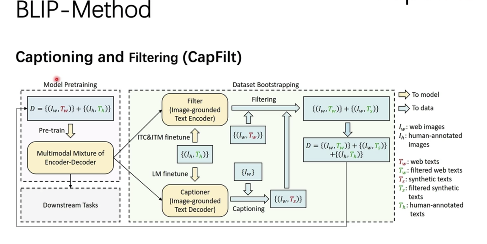 
如图：其中Iw：web图片，In，人工标注图片。Tw，web文本，Tw是过滤后的web文本(和图片高匹配度的)，Ts是模型(通过在人工标注的图片文本对数据上finetue ITC和ITM任务)生成的合成文本(利用finetune的LM进行生成)，Ts是过滤后的模型caption合成文本，Th是人工标注的文本。 
目的：因为web图片和文本对有较多噪音，利用人工标注的数据在ITC，ITM任务，LM任务上进行finetune，分别得到filter模块(ITC，ITM任务)和caption模块(LM任务)，利用LM模型对web图片生成caption(Tx)；然后用finetune后的LM任务根据图片生成描述 
**最终BLIP预训练的数据为：人工标注图片文本对+过滤后的web图片文本对+过滤后的web图片和生成文本对** 

#### BLIP2
《BLIP-2: Bootstrapping Language-Image Pre-training with Frozen Image Encoders and Large Language Models》，202301   
动机：端对端从0开始预训练图像embedding和文本embedding非常耗时，如果可以固定图像和文本的预训练模型参数就会很好。   
逻辑：通过Q-former模块实现，在freeze图片预训练模型和文本预训练模型的同时，降低图片语义和文本语义的gap。   
**BLIP-2优势** 
1、高效利用frozen预训练视觉及语言模型；   
2、由于大规模语言模型能力，BLIP-2可以根据提示进行zero-shot图像到文本生成；    
3、由于使用frozen单模态预训练模型，BLIP-2与现有SOTA方案相比，计算更加高效；   
**算法** 
为了对齐视觉特征到LLM文本空间，作者提出Q-Former，进行两阶段预训练： 
1、图像编码器frozen进行学习视觉语言表征； 
2、使用frozen LLM进行学习视觉到文本生成；  
**模型结构** 
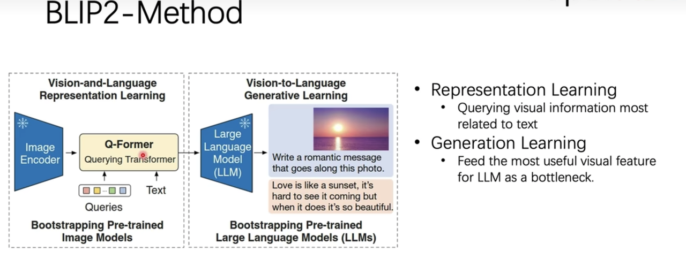 
**第一阶段** 
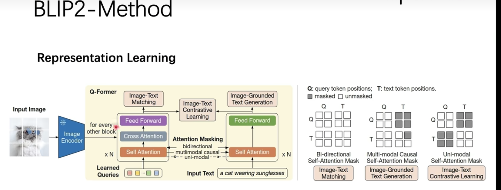 
如图，在训练时，输入为：图片和文本。初始化一组可学习的参数，Learned Queries。通过固定图片的模型参数，学习由文本只是引导的拥有丰富跨模态信息的latent query.第一阶段训练使用的任务ITC，ITM，ITG，ITG是为了让模型拥有更强的生成能力而引入。 
**第二阶段** 
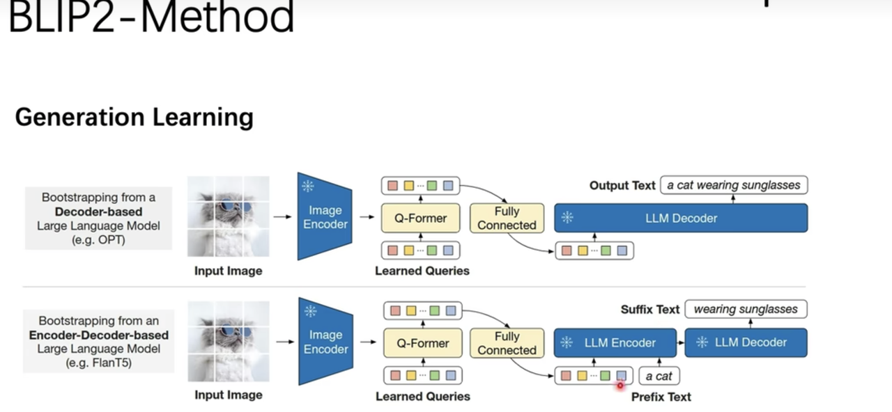 
如图，训练时，固定视觉模型的参数经过Q-former后，接一个全连接层，做一个LM的任务(两种：完全生成，续写生成)。 

Q-Former包括两个共享self-attention层的transformer子模块：图像transformer（Q-Former左半部分）与frozen image encoder相互作用提取视觉特征；文本transformer（Q-Former右半部分）可作为文本编码器，也可作为文本解码器。   
可学习query embedding作为图像transformer输入，通过self-attention层相互作用，通过cross-attention层与frozen图像特征相互作用，query同时通过self-attention层与文本相互作用。根据预训练任务，作者使用不同self-attention mask控制query-text之间交互；作者使用BERT-base初始化Q-Former，cross-attention层进行随机初始化；   
